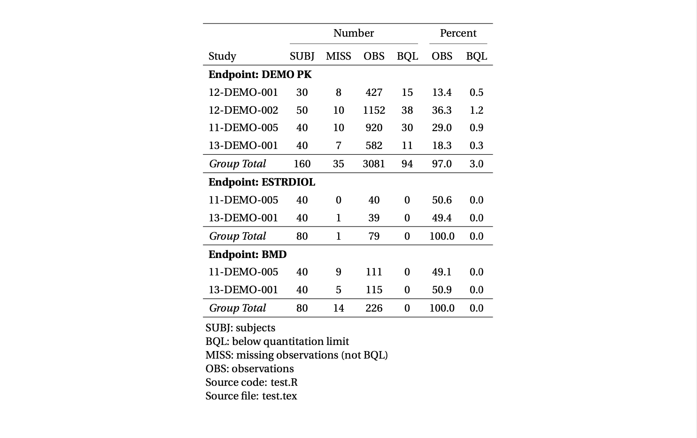
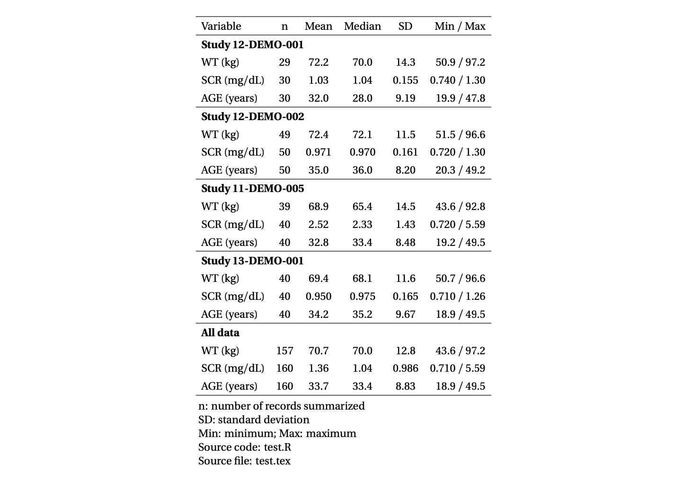
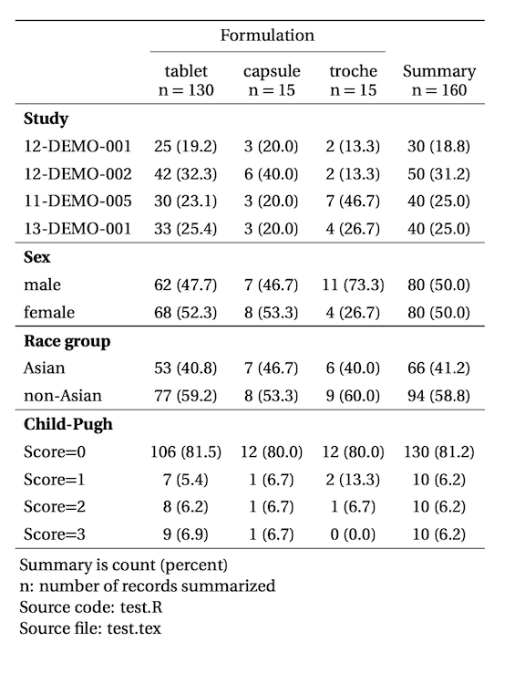

# Introducing pmtables

This is a simple introduction to the pmtables package for R. We hope this will 
be useful for those who are new to the package and those who just need a 
reminder on the syntax. 

See the pdf [here](pmt-intro.pdf)

# Examples

Data inventory 

Continuous data summary

Categorical data summary

